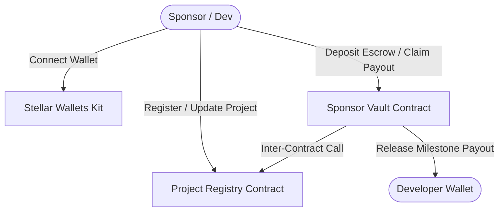
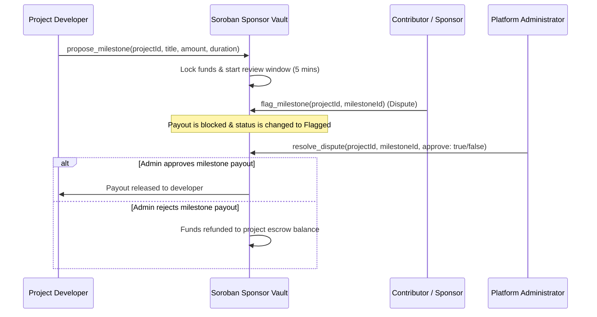

# Stellar Sponsors 🚀
### Decentralized Open-Source Sponsorship Platform on Stellar Soroban

Stellar Sponsors is a decentralized platform for sponsoring open-source repositories with transparent, milestone-gated blockchain payments. By leveraging Stellar's fast and low-cost **Soroban Smart Contracts**, sponsors can fund projects in any Stellar Asset Contract (SAC) token, and developers can unlock funding as they deliver verified milestones.

---

## 🏗️ Architecture Design



### Milestone Escrow & Dispute Resolution Flow



---

## 🛠️ Key Features

1. **Project Registry (`ProjectRegistry.wasm`)**:
   - Register projects with decentralized Git metadata.
   - Upgradeable owner controls.
   - Admin-verified statuses for project safety.
2. **Gated Milestone Vault (`SponsorshipVault.wasm`)**:
   - Escrow contracts that hold deposited Stellar Assets (defaults to Native XLM).
   - Milestone proposing, locking, and automatic completion triggers.
   - **Dispute Flagging Mechanism**: Contribution-weighted voting that enables sponsors to flag/halt milestone payouts within a time-locked review window.
   - Admin RBAC (Role-Based Access Control) arbitration to resolve flagged milestone disputes.
3. **High-Fidelity Next.js 15 App**:
   - Stunning visual aesthetics (dark mode, glassmorphism, glowing micro-animations).
   - Dynamic real-time event poller polling event logs from Soroban RPC.
   - Complete transaction center listing pending, processing, and failed transactions with error diagnostics and retries.
   - Direct integration with multi-wallet kits (Freighter, Albedo, xBull).

---

## 📋 Smart Contract Methods

### Project Registry Contract (`ProjectRegistry`)
- `initialize(admin: Address)`: Set the administrator role.
- `register_project(owner: Address, name: String, github_url: String, description: String, category: String) -> u64`: Register a new project and assign a sequential ID.
- `verify_project(project_id: u64, verified: bool)`: Admin-only verification toggle.
- `transfer_ownership(project_id: u64, new_owner: Address)`: Transfer project owner rights.
- `get_project(project_id: u64) -> Option<Project>`: Retrieve project metadata.
- `get_project_count() -> u64`: Retrieve total registered projects.

### Sponsorship Vault Contract (`SponsorVault`)
- `initialize(admin: Address, registry: Address, token: Address)`: Initialize contract linkage.
- `sponsor_project(project_id: u64, sponsor: Address, amount: i128)`: Deposit funds into a project's escrow.
- `propose_milestone(project_id: u64, title: String, description: String, amount: i128) -> u32`: Propose a project milestone.
- `start_milestone(project_id: u64, milestone_id: u32, lockup_duration_seconds: u64)`: Project owner starts review countdown window.
- `flag_milestone(project_id: u64, milestone_id: u32, sponsor: Address)`: Sponsor raises dispute on active milestone.
- `claim_milestone(project_id: u64, milestone_id: u32)`: Release funds to developer if review window expires without disputes.
- `resolve_dispute(project_id: u64, milestone_id: u32, approve: bool)`: Admin arbitrates flagged disputes.

---

## 🚀 Getting Started

### Prerequisites
Make sure you have the following installed:
- [Rust & Cargo](https://rustup.rs/) (v1.75+)
- [stellar-cli](https://developers.stellar.org/docs/build/smart-contracts/getting-started/setup#install-stellar-cli) (v27+)
- [Node.js](https://nodejs.org/) (v20+)

### 1. Smart Contract Compilation
Build WebAssembly binaries for the contracts:
```bash
./scripts/build.sh
```

### 2. Deploy Contracts (Testnet)
Deploy the contracts to the Stellar Testnet. This script automatically generates an administrator identity, deploys the Wasm binaries, initializes both contracts, and writes the addresses to `src/contracts.json`:
```bash
./scripts/deploy.sh
```

### 3. Frontend Installation & Running
Set up environment variables by copying the example file:
```bash
cp .env.example .env.local
```
Install npm packages and run the local development server:
```bash
npm install
npm run dev
```
Open [http://localhost:3000](http://localhost:3000) to view the application.

---

## 🧪 Testing

### Rust Contracts
Run cargo smart contract unit tests:
```bash
cargo test --manifest-path contracts/Cargo.toml
```

### Frontend Tests
Run Vitest component and state store tests:
```bash
npx vitest run
```

---

## 📜 License
This project is open-source under the MIT License.
